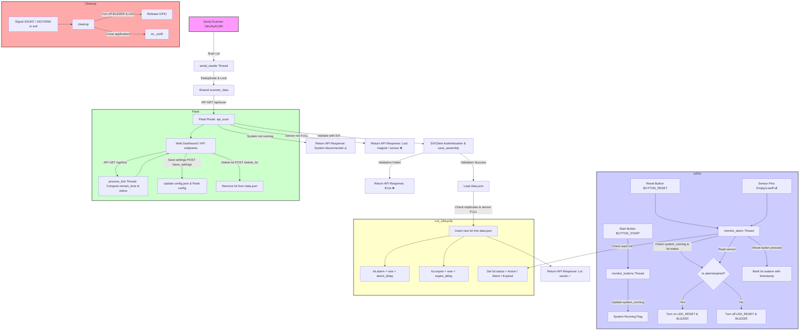

```mermaid
flowchart TD
    %% Scanner Input
    A[Serial Scanner /dev/ttyACM0] -->|Scan Lot| B[serial_reader Thread]
    B -->|Deduplicate & Lock| C[Shared scanner_data]

    %% Flask API Scan
    C -->|API GET /api/scan| D[Flask Route: api_scan]
    D -->|Validate with SVI| E[SVIClient Authentication & save_assembly]
    E -->|Validation Success| F[Load data.json]
    F -->|Check duplicates & sensor FULL| G[Insert new lot into data.json]
    G --> H[Return API Response: Lot saved ✅]
    E -->|Validation Failed| I[Return API Response: Error ❌]
    D -->|System not running| J[Return API Response: System disconnected ⚠️]
    D -->|Sensor not FULL| K[Return API Response: Lost magnet / sensor ❌]

    %% GPIO Threads
    subgraph GPIO
        L[Start Button BUTTON_START] --> M[monitor_buttons Thread]
        M -->|Update system_running| N[System Running Flag]
        
        O[Reset Button BUTTON_RESET] --> P[monitor_alarm Thread]
        P -->|Check system_running & lot status| Q{Is alarm/expired?}
        Q -->|Yes| R[Turn on LED_RESET & BUZZER]
        Q -->|No| S[Turn off LED_RESET & BUZZER]
        P -->|Reset button pressed| T[Mark lot.isalarm with timestamp]
        
        U[Sensor Pins Empty/Low/Full] --> P
        P -->|Read sensor| Q
    end

    %% Flask API / Dashboard
    subgraph Flask
        D --> V[Web Dashboard / API endpoints]
        V -->|API GET /api/lots| W[process_lots Thread: Compute remain_time & status]
        W --> V
        V -->|Save settings POST /save_settings| X[Update config.json & Flask config]
        V -->|Delete lot POST /delete_lot| Y[Remove lot from data.json]
    end

    %% Lot Lifecycle
    subgraph Lot_Lifecycle
        G --> AA[lot.alarm = now + alarm_delay]
        G --> AB[lot.expire = now + expire_delay]
        P -->|Check each lot| AC[Set lot.status = Active / Alarm / Expired]
    end

    %% Cleanup & Exit
    subgraph Cleanup
        Z[Signal SIGINT / SIGTERM or exit] --> ZA[cleanup]
        ZA -->|Turn off BUZZER & LED| ZB[Release GPIO]
        ZA -->|Close application| ZC[os._exit0]
    end

    %% Styling
    style A fill:#f9f,stroke:#333,stroke-width:2px
    style GPIO fill:#ccf,stroke:#333,stroke-width:2px
    style Flask fill:#cfc,stroke:#333,stroke-width:2px
    style Lot_Lifecycle fill:#ffc,stroke:#333,stroke-width:2px
    style Cleanup fill:#faa,stroke:#333,stroke-width:2px
```